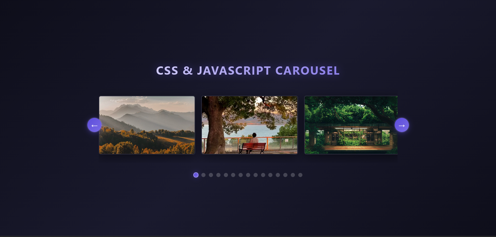

# CSS & JavaScript Carousel

A lightweight, responsive media carousel built with vanilla HTML, CSS, and JS.


<p><em>This is how it's going to look</em></p>

## ✨ Features

- **Zero Dependencies**: Pure HTML/CSS/JS.
- **Mixed Media**: Supports images & videos.
- **Responsive**: Mobile-first design.
- **Controls**: Mouse, touch snap, and keyboard arrows (`←` `→`).

## 🚀 Quick Start

1. Clone the repo.
2. Open `index.html` in your browser.
3. *Optional*: Use a local server (e.g., Live Server) for reliable video autoplay.

## 🛠️ Customization

- **Add Media**: Drop files in `images/` and add card divs in `index.html`:
  ```html
  <div class="Card"></div>
  ```
- **Colors**: Edit CSS variables in `style.css` (`:root`).

